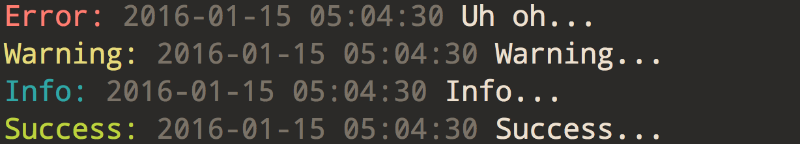

# Pretty Log

Pretty logs stuff to the console in Node apps.

## Usage

```
npm install node-pretty-log
```

Then, in your JavaScript:

```javascript
const log = require('node-pretty-log');

log('error', 'Uh Oh...');
log('warn', 'Warning...');
log('info', 'Info...');
log('success', 'Success...');
```

And the results:



You can also use multiple strings or variables. Example:

```javascript
const log = require('node-pretty-log');

const error = { ok: false };
const warning = { data: 'missing semicolon' };
const info = 'This is some string info';
const success = { ok: true };

log('error', 'Uh Oh...', error);
log('warn', 'Warning...', warning);
log('info', 'Info...', info);
log('success', 'Success...', success);
```

## License

MIT
